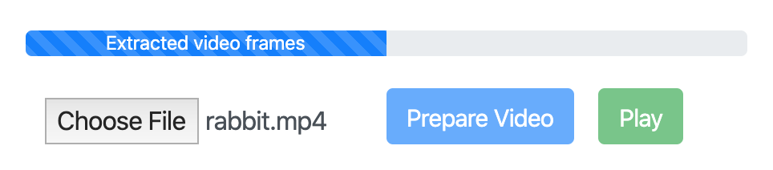

# yolo-frames-video
html canvas video with yolov2-tiny object detection in the browser

Due to sunk cost fallacy, I decided to improve on https://github.com/Jaytu72/yolo-laggy-video by extracting the frames before doing any predictions. The predicted frames are then drawn onto a canvas in order to simulate a video.

<p align="center">

</p>

1. Navigate to the server directory and run the following on the shell:
```shell
node server.js
```
2. Upload a video.

3. Click the 'Prepare Video' button to extract the frames and predict on them. This will take a while.

<p align="center">

</p>

4. Click the 'Play' button to play the processed frames.
